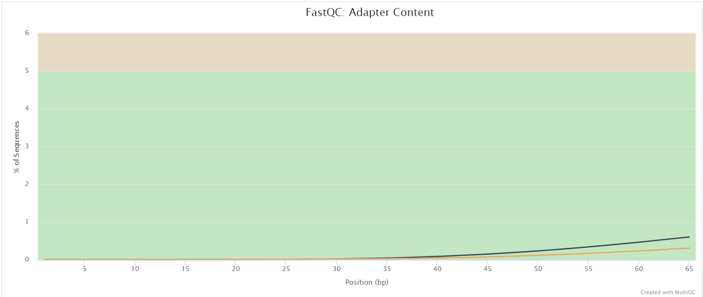

# nf-core/hlatyping: Output

## Introduction

This document describes the output produced by the pipeline. Most of the plots are taken from the MultiQC report, which summarises results at the end of the pipeline.

The directories listed below will be created in the results directory after the pipeline has finished. All paths are relative to the top-level results directory.

## Pipeline overview

The pipeline is built using [Nextflow](https://www.nextflow.io/) and processes data using the following steps:

* [FastQC](#fastqc) - Raw read QC
* [OptiType](#optitype) - HLA genotyping based on integer linear programming
* [MultiQC](#multiqc) - Aggregate report describing results from the whole pipeline
* [Pipeline information](#pipeline-information) - Report metrics generated during the workflow execution

### FastQC

<details markdown="1">
<summary>Output files</summary>

* `fastqc/`
  * `*_fastqc.html`: FastQC report containing quality metrics.
  * `*_fastqc.zip`: Zip archive containing the FastQC report, tab-delimited data file and plot images.

</details>

[FastQC](http://www.bioinformatics.babraham.ac.uk/projects/fastqc/) gives general quality metrics about your sequenced reads. It provides information about the quality score distribution across your reads, per base sequence content (%A/T/G/C), adapter contamination and overrepresented sequences. For further reading and documentation see the [FastQC help pages](http://www.bioinformatics.babraham.ac.uk/projects/fastqc/Help/).




> **NB:** The FastQC plots displayed in the MultiQC report shows _untrimmed_ reads. They may contain adapter sequence and potentially regions with low quality.

## OptiType

[OptiType](https://github.com/FRED-2/OptiType) is an HLA genotyping algorithm based on linear integer programming. It provides accurate 4-digit HLA genotyping predictions from NGS data.
For further reading and documentation see the [OptiType documentation](https://github.com/FRED-2/OptiType).

The pipeline results contain a CSV file with the predicted HLA genotype. Each line contains one solution with the predicted HLA alleles in 4-digit nomenclature, the number of reads that are covered by this solution and the objective function value. If the number of enumerations (--enumerate N) is higher than 1, the CSV file will contain the optimal and sub-optimal solutions.

```tsv
    A1  A2  B1  B2  C1  C2  Reads   Objective
0   A*01:01 A*01:01 B*08:01 B*57:01 C*07:01 C*06:02 1127.0  1106.7139999999997
```

Additionally, a coverage plot of the predicted HLA genotype is produced for quality control purposes (see below). The coverage plot shows the amount of reads that cover every position of the selected HLA allele sequence. Further, the color encoding denotes if reads are paired or unpaired, contain mismatches, and if the matches are unique or ambiguous. In case of homozygous solutions, the coverage plot of the corresponding HLA allele will be shown once.


**Output directory: `results/{timestamp}`**

* `{prefix}_{timestamp}_result.tsv`
  * TSV file, containing the predicted optimal (anf if enumerated, sub-optimal) HLA genotype
* `{prefix}_{timestamp}_coverage_plot.pdf`
  * pdf file, containing a coverage plot of the predicted alleles

### MultiQC

<details markdown="1">
<summary>Output files</summary>

* `multiqc/`
  * `multiqc_report.html`: a standalone HTML file that can be viewed in your web browser.
  * `multiqc_data/`: directory containing parsed statistics from the different tools used in the pipeline.
  * `multiqc_plots/`: directory containing static images from the report in various formats.

</details>

[MultiQC](http://multiqc.info) is a visualization tool that generates a single HTML report summarising all samples in your project. Most of the pipeline QC results are visualised in the report and further statistics are available in the report data directory.

Results generated by MultiQC collate pipeline QC from supported tools e.g. FastQC. The pipeline has special steps which also allow the software versions to be reported in the MultiQC output for future traceability. For more information about how to use MultiQC reports, see <http://multiqc.info>.

### Pipeline information

<details markdown="1">
<summary>Output files</summary>

* `pipeline_info/`
  * Reports generated by Nextflow: `execution_report.html`, `execution_timeline.html`, `execution_trace.txt` and `pipeline_dag.dot`/`pipeline_dag.svg`.
  * Reports generated by the pipeline: `pipeline_report.html`, `pipeline_report.txt` and `software_versions.yml`. The `pipeline_report*` files will only be present if the `--email` / `--email_on_fail` parameter's are used when running the pipeline.
  * Reformatted samplesheet files used as input to the pipeline: `samplesheet.valid.csv`.

</details>

[Nextflow](https://www.nextflow.io/docs/latest/tracing.html) provides excellent functionality for generating various reports relevant to the running and execution of the pipeline. This will allow you to troubleshoot errors with the running of the pipeline, and also provide you with other information such as launch commands, run times and resource usage.
